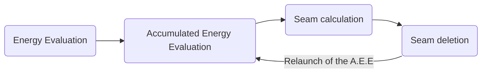

# Image Processing

In this project, I was willing to discover specific concepts of image processing, outside of the basic segmentations, dilatation, etc..
This is the reason why I have developed these processes in particular. Let me, now, introduce them to you :

## Seam carving

Well explained in this Princeton University [exercise](https://www.cs.princeton.edu/courses/archive/fall14/cos226/assignments/seamCarving.html), the main concept of Seam carving is simple. It may happen that oneself wants to resize an existing picture but without either croping it, because of the loss of information, or scaling it, because of the induced distortion.
| |Base picture                |Croped picture               |Scaled Picture        |
|-|----------------|-------------------------------|-----------------------------|
|**Examples**|   || |
|**Drawbacks**|Too big         |Loss of information|Distorted picture           |

This is where Seam Carving is used : it allows to reduce the size of a picture by choosing the pixels of least importance using *Seams*.

### Energy Calculation
Here, we will present two notions :
- The energy of a pixel
- And the accumulated energy of a pixel

My interpretation of the energy of a pixel of $(x,y)$, $x$ designating the row its situated and $y$ the column, has been the following :

 $energy(x,y) = \Delta _x (x,y)^2 + \Delta _y (x,y)^2$ where :
  - $\Delta _x (x,y)^2 = R _x (x,y)^2 + G _x (x,y)^2 + B _x (x,y)^2$ with R, G and B designating the difference in respectively red, green and blue components between the pixel on the left of $(x,y)$ and the one on its right.
  - $\Delta _y (x,y)^2 = R _y (x,y)^2 + G _y (x,y)^2 + B _y (x,y)^2$ with R, G and B designating the difference in respectively red, green and blue components between the pixel above of $(x,y)$ and the one below.

Let's, now, consider this configuration and the formulas above.

(255,125,125) | (0,125,0)  | (255,255,0)
- | - | -
 **(0,0,125)** | *p* | **(125,125,255)**
 **(255,125,255)** | **(0,255,0)** | **(125,0,125)**

We find these results for the pixel *p* :
 - For the *x* component :

| $R _x (p)^2$ |  $G _x (p)^2$ | $B _x (p)^2$ | $\Delta _x (p)^2$ |
| ------------ | -------------  | ----------- | --------- |
| $(0-125)^2=15625$ | $(0-125)^2=15625$ | $(125-255)^2 = 15625$ | $46875$ |

 - For the *y* component :

| $R _y (p)^2$ |  $G _y (p)^2$ | $B _y (p)^2$ | $\Delta _y (p)^2$ |
| ------------ | -------------  | ----------- | --------- |
| $(0-0)^2=0$ | $(125-255)^2=15625$ | $(0-0)^2 = 0$ | $15625$|

So the final energy of the pixel *p* would be : $\Delta _x (p)^2 + \Delta _y (p)^2 = 62500$.

We apply this process for every single pixels, even the one on the border of the image. For these ones, we apply a particular process where we don't consider both its right and left neighbours and top and bottom neighbours (depending on the border it is situated) but others pixels. It will get more clear with an example :
For the pixel $(0,1)$, situated all the way to the top, we will choose, to calculate its $\Delta _y$ component, the pixels $(1,1)$ and $(3,1)$, etc..

So, once every single pixel has got its energy evaluated, we now have to calculate the notion of *Accumulated energy*.
The accumulated energy of a pixel corresponds to the cost of the cheapest existing path between this pixel and one of the top pixels. If you are discerning enough, you may have noticed that this process will start from the top line and continue to the end, with every top pixels having its *accumulated energy* set at the value of its *energy*. After the first line has been initiated, we progress by choosing for each pixel of the second one of its top neighbour (top-left, top and top-right) based on its value. The whole idea of this process is to choose the top neighbour of lowest cost. We continue this process with the third, forth line and so on.
The important thing to notice at this point is that the bottom line of our *accumulated energy* component contains the information on the cost of the cheapest path from anywhere on top to anywhere at the bottom : it is the lowest value amongst the bottom line. We will now use this information to find a seam.

### Seams
Processed vertically in my application *- possibly horizontally, depending on the resizing -*, seams are a list of pixels connecting the top to the bottom of an image, through a path, with one pixel per row of the given image.
//Exemple de Seam à afficher
They use the notion of *Accumulated energy* we explained before to calculate the path of lowest cost. To find this path of lowest cost, we first have to find the pixel of lowest *accumulated energy* value at the bottom of the image. Then, we will look at its 3 top neighbours and select the one whose *accumulated energy* value equals the one of the current pixel minus the *energy* value of the current pixel.  We go on and on with this strategy until we reach the top of the image. The list of all the pixels we've encountered is our seam. We just have to delete them from the image and re-evaluate the *accumulated energy* of its pixels.

### Flow chart
If we had to design a flow chart of the whole process of Seam Carving, it would look just like this :

We repeat this loop until we have reached the desired amount of calculated seams.

### Process Results

An example of a successful operation applied to the same picture I presentend earlier is as followed :
| Starting Picture | Seam Calculation | Post-Process |
| ------------------ | --------------------- | --------- |
| | | |

One interpretation we can make of this result if that the pixels of lowest energy are situated on the right-hand side of the picture. Indeed, we might think, at first glance, that the most important infos are contained in the center of the image with the hut and on its left-hand side with the snowy and detailed mountains. And that is the conclusion drawn by our algorithm.

As it is open source, it is all free for you to explore, edit and improve my code.
